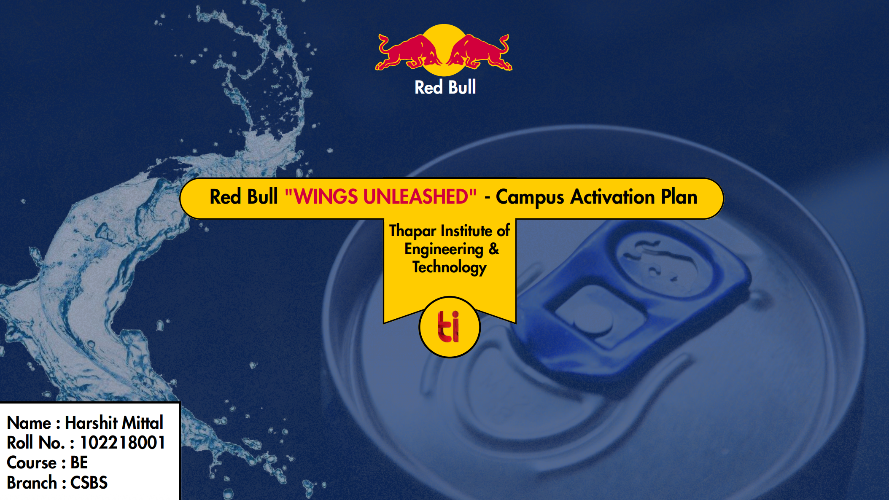

# 🪽 Red Bull "Wings Unleashed" - Campus Activation Plan

This repository contains my case study presentation prepared as part of **Red Bull’s campus activation challenge** at **Thapar Institute of Engineering & Technology**.

---

## 📌 Overview
**Theme:** *"Every Challenge. Every Victory. Every Wing Earned."*  

The event aimed to **transform the campus into a high-energy battleground** across 4 dynamic zones:
1. **Adrenaline Arena** (Sports Zone)  
2. **Digital Battleground** (Gaming Zone)  
3. **Culture Colosseum** (Arts & Culture)  
4. **Viral Velocity** (Digital Content Zone)  

---

📄 [Download Full Case Study (PDF)](./RedBull.pdf)
  

---

## 🔑 Key Highlights
- 🎯 **Pre-Event Hype Campaign** with influencer teasers & gamified registrations  
- 🏆 **Zone-based competitions** (Sports, Gaming, Culture, Digital Content)  
- ⚡ **Gamification** via "Energy Passport" with real-time leaderboards  
- 🎶 **Society Collaboration Plan** across cultural, sports, technical, and media groups  
- 📢 **Marketing Strategy** → Social media, influencer network, campus branding  
- 💸 **Estimated Budget** → ₹3.2 Lakhs with detailed breakdown  
- 📈 **KPIs to Measure Success** → Engagement, Brand Recall, Revenue Impact  

---

## 📸 Preview

---

## 📊 Post-Event Strategy
- Winner Announcements & Recap Videos  
- Red Bull Campus Ambassador Program  
- Digital Community Building with monthly challenges  
- Alumni Network & Cross-Campus events  

---

## ✨ Author
👤 **Harshit Mittal**  
📧 mittalharshit093@gmail.com 
🔗 [LinkedIn](https://www.linkedin.com/in/mittalharshit23/)  

---
